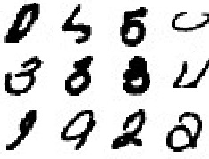

# MNIST Handwritten Digit Recognition by Deep Convolutional Neural Network (CNN)  Using Keras Platform

The goal of the project is to design and evaluate a deep convolutional neural network to classify handwritten digits images in the famous dataset of [MNIST](http://yann.lecun.com/exdb/mnist/) dataset. We used Keras which is an open-source neural-network library written in Python.


## Getting Started
Handwritten digit recognition has been a famous challenge in computer vision for many years. It can be used in different applications such as OCR. MNIST is a comprehensive dataset with 70K images of handwritten digits which first has been created and released in 1998. Since then, different works have used various classifiers such as linear classifiers, SVM, KNN, and ANN to classify MNIST. Recently with the increasing popularity of deep neural network, they have shown great performance in MNIST challenge as well. In this project, we designed and evaluated a deep convolutional neural network to approach this traditional challenge in this dataset. The code includes one script code written in Python (attached) that has all the implementations.

### Prerequisites
You can run this code on any computer with at least 8GB of memory with have Python 3  and [Keras](https://keras.io/) installed. You also need the following Python libraries installed:
- Matplotlib
- Tensorflow
- Numpy
- Scikit-learn

This project is tested by Python 3.7.2 and Keras 2.2.4. One easy way to run this code is using [Google Colab](https://colab.research.google.com/notebooks/welcome.ipynb#recent=true) that is a free cloud service by Google. Google Colab enables programming python online while you have access to GPUs for faster parallel computing very useful for training deep networks.


## Installing
In this document, we explain how to run this code in Google Colab however it can be easily used in any personal computer as well. For using Google cloud service, go to [Google Colab](https://colab.research.google.com/notebooks/welcome.ipynb#recent=true) and create a free account. Create an empty notebook and make a code block in your notebook. Open the python script attached to this document with any text editor and copy-paste the file content in your code block in Google Colab notebook. From the menu bar at the top, connect to the remote machines by pressing the "Reconnect" icon at the right. Wait until you are connected and you can see the memory ("RAM") and storage space ("Disk") status in the remote machine. 

## Network structure 
In this project, we designed a CNN network contains combination of convolution and fully connected layers. The architecture of the network is shown in the following table. 


| Layer (in order)          | Output Shape              | Param  |
| -------------             |:-------------:            | -----:|
|conv2d_12 (Conv2D)         | (None, 26, 26, 32)        | 320       
|conv2d_13 (Conv2D)         | (None, 24, 24, 32)        | 9248      
|max_pooling2d_6 (MaxPooling2| (None, 12, 12, 32)       |0         
| dropout_3 (Dropout)        |(None, 12, 12, 32)        |0  
|conv2d_14 (Conv2D)          | (None, 10, 10, 32)       |9248      
|conv2d_15 (Conv2D)          |(None, 10, 10, 32)        |9248      
|max_pooling2d_7 (MaxPooling2|(None, 5, 5, 32)          |0         
|flatten_18 (Flatten)         |(None, 800)              | 0         
|dense_53 (Dense)             |(None, 512)              | 410112    
|dense_54 (Dense)             |(None, 64)               | 32832     
|batch_normalization_v1_17 (B |(None, 64)               | 256       
|dense_55 (Dense)             |(None, 10)               | 650       
```
Total params: 471,914
Trainable params: 471,786
Non-trainable params: 128
```
In the design of this network, we first started with simpler deep architecture without any convolution layers by using flatten layer and some fully connected layers. However just adding few convolution layer with training different filters in convolution layer, we achieved higher performance. 

The final design is a hierarchical structure of the network that combined convolution layers with pooling layers steps by step and at the last layers, fully connected layers are used to help the final clarification based on extracted features in convolution layers.

The structure of the network can be changed by either changing layers' size or type or adding some layers. Adding more layers could not improve the performance as it already has very high accuracy and it will just increase running time. The parameters of the network in each layer also can be changed as a possible modification, however, we could not get better results by trying some variations. 

## Running the code
After creating the notebook and copying the python script in your notebook, you run the code block. The program shows the progress of training networks in addition to some report on the input data. When the training progress finished for all the defined epochs, the program shows both **loss** and **accuracy** of the network in predicting images' class for training, validation, and test images.

## Some results
A sample running of the code results in the following performance measurements:
```
48000/48000 [====================] - 39s 820us/sample - loss: 0.0116 - acc: 0.9964
12000/12000 [====================] - 10s 824us/sample - loss: 0.0328 - acc: 0.9916
10000/10000 [====================] - 8s 825us/sample - loss: 0.0246 - acc: 0.9927
Accuracy:  train: 0.996  valid: 0.992  test: 0.993
    Loss:  train: 0.012  valid: 0.033  test: 0.025
```
Sample of challenging images for the classifier.



## Authors

* **Mahzar Eisapour**, University of Waterloo, Waterloo, Canada.
    *  Linkedin profile: https://www.linkedin.com/in/mahzar/
    *  email: eisapour@uwaterloo.ca

## License

This code is released the GPL.

## Acknowledgments

